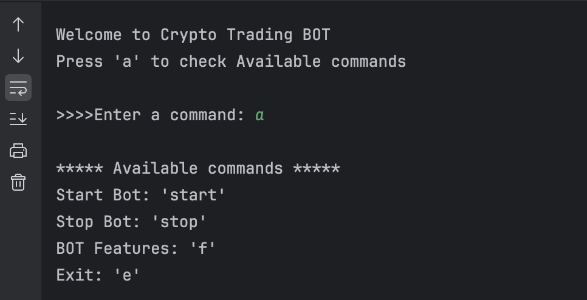

# CRYPTO TRADING BOT
⚠️***️ WARNING:*** This bot is for educational purposes only. Use at your own risk. By using this bot, you agree that you are responsible for any losses incurred. The author is not liable for any damages or losses resulting from the use of this bot. Please do your own research and use caution when trading cryptocurrencies.

**DEV MESSAGE**: This bot is still in development and may not work as expected. If you encounter any issues or want to share ideas, please contact me through my [mail.](oomer9942@gmail.com)

1. [Introduction](#introduction)
2. [Setup](#setup)
   - [Requirements](#requirements)
   - [Installation](#installation)
   - [Get Activation Key](#get-activation-key)
   - [Running the Bot](#running-the-bot)
3. [Features](#features)
   - [Price Alert Bot](#price-alert-bot)
   - [BTC News Bot](#btc-news-bot)
   - [SMS Alerts](#sms-alert)
   - [Automated Trading](#automated-trading)
   - [Telegram Alerts](#telegram-alerts)
   - [Gmail Alerts](#gmail-alerts)
4. [How to Use](#how-to-use)
   - [Check Available Commands](#check-available-commands)
   - [Buy/Sell](#buy-sell)
   - [Setting stop loss](#setting-stop-loss)
   - [Chase Price](#chase-price)

## Introduction

## Setup
### Requirements:
### Installation:

Create a file named `.env` in the same directory as the bot script and add your information. Here is an example of what it should look like:

```text
API_KEY=your_key_here
DEBUG=True
```
Install the required packages using pip:
```bash
pip3 install ccxt, dotenv, pandas
```

## Features
### Automated Trading Bot:

Mathematical trading bot that uses various strategies to trade:
1. Monte Carlo Simulation

2. Kelly Criterion

3. Sharp Ratio

4. Expected Value


## How to Use
### Check Available Commands:
To check the available commands, run the bot with the `a` option:


### Buy/Sell:
#### Market Orders:
Long BTC/USDT with 0.01 BTC, stop loss at 2% and take profit at 6%:
```bash
b btc/usdt 0.01 stop 2 tp 6
```

Short BTC/USDT with 0.03 BTC, stop loss at 4% and take profit at 10%:
```bash 
s btc/usdt 0.03 stop 4 tp 10
```

Close all positions (Market Order):
```bash
nuke
```

#### Limit Orders:
Limit order to buy BTC/USDT at $30,000 with 0.01 BTC:
```bash
limit b btc/usdt 0.01 30000
```

Limit order to sell BTC/USDT at $35,000 with 0.01 BTC:
```bash
limit s btc/usdt 0.01 35000
```

Chase Price (Limit Order):
```bash
chase b btc/usdt 0.01 30000
```

### Running the Bot:
To run the bot, use `start` command. You can also specify the `--debug` command to enable debug mode, which will print additional information to the console.
Use `f` command to display active bots and their status.
If you want to run the bot in the background, use `nohup` command. Finally if you want to end the bot, use `stop` command. The bot(s) will pause but you are still active.

In order to fully exit the bot, use `e` command. This will stop all bots and exit the program.

